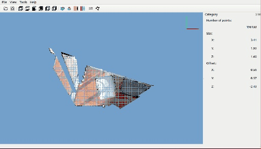

# Based on the original open-source code of [PSAT](https://github.com/yatengLG/PSAT.git), several new features have been added. If you have any questions, please contact me via [email](491498408@qq.com).

# Update
The following new features have been added based on PSAT:
1. Support using the A/D shortcut keys to switch between the previous and next point clouds.
2. Auto-save is enabled when the software starts; it can be manually disabled (the auto-save button shares the same icon as the save button but can be distinguished by its tooltip).
3. Support for setting the point cloud rotation center. This feature is automatically enabled when the software starts and can be disabled in the panel.
4. Support for point cloud filtering. A filter button is located next to "Pick"; after clicking, you can select the point clouds to retain and right-click to finish. Clicking the icon again restores the display of all point clouds.
5. Fixed the issue of program crashes when displaying instances.
6. Support for exporting to an executable. Use `python -m PyInstaller --noconfirm --clean PSAT.spec`; the exported .exe file will be located at `dist/PSAT.exe`.
7. Support for setting a custom folder to save results. If not set, results are saved in the point cloud folder by default.
8. Support for online visualization of point cloud projection.
    - Step 1: Click "Load Projection Calibration" to import intrinsic/extrinsic parameters and the image folder path. The parameter format should follow `example/debug/0818080124090003.json`. Image filenames in the folder must match the point cloud names, with common image extensions (e.g., jpg, png, jpeg).
    - Step 2: Click "Projection Overlay" to display the projection results; uncheck the button to hide the image.
    - Step 3: Use `CTRL + Mouse Wheel` to adjust the image size; use `SHIFT + Mouse Wheel` to adjust the projection point size.  
    

9. Fixed the issue of continuously increasing RAM usage during dragging, rotating, or annotating point clouds. With projection visualization enabled, RAM usage now stabilizes at around 80 MB.
10. Support for pre-annotation. Click the "Pre-annotate Next" button to enable pre-annotation. The software will cache the current annotation results to automatically generate annotation previews for the next frame. The "Pre-annotate Window Size" controls the number of cached frames for pre-annotation. A larger window size produces more complete pre-annotation results but may introduce more noise for moving objects if too many frames are cached.

# [PSAT](http://www.yatenglg.cn/psat) - Point cloud segmentation annotation tools


[中文](README.md) [English](README-en.md)

## Install

```shell
git clone https://github.com/yatengLG/PSAT.git
cd PSAT
conda create -n PSAT python==3.8
conda activate PSAT
pip install -r requests.txt
```

## Annotate
1. Add category and set color for show in setting.
2. Open point cloud file
3. Start annotate by button named [Pcik],draw polygon to select area by left button of mouse.
3. End annotate by right button of mouse.
4. Select category and set group if for instance.


## Ground filter
Software integrated with [CSF](https://github.com/jianboqi/CSF)，and provide the function of quickly extracting the ground 。
The software turns off the ground filtering function by default. 
Manually install the [CSF](https://github.com/jianboqi/CSF#how-to-use-csf-in-python), and then automatically turn on the ground filtering function.


