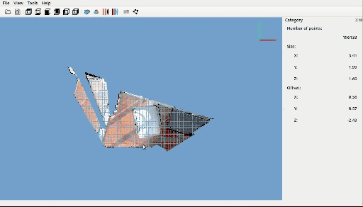
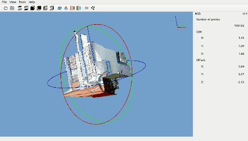

# 基于原[PSAT](https://github.com/yatengLG/PSAT.git)开源代码,添加了一些新的功能特性.
# Update
基于PSAT添加了一些新的功能
1. 支持A/D快捷键切换上下点云
2. 打开软件即开启自动保存，可自行取消（自动保存按钮与保存按钮icon一致，可通过浮显文字区分）
3. 支持设置点云旋转中心。软件开启会自动开启该功能，可自行在面板取消。
4. 支持点云过滤。在pick旁有个filter按钮，点击后可以选择保留的点云，右键鼠标结束。当再次点击该icon时，恢复显示所有点云。
5. 修复instance显示时程序崩溃问题。
6. 支持exe导出。python -m PyInstaller --noconfirm --clean PSAT.spec，导出exe位于dist/PSAT.exe
7. 支持设置保存结果文件夹,若不设置默认保存在点云文件夹

# [PSAT](http://www.yatenglg.cn/psat) - 点云分割标注工具


[中文](README.md) [English](README-en.md)

# 简介
深度学习点云分割标注工具

1. 实现十万级别点云流畅标注,百万级别点云流畅可视化
2. 支持同时标注语义分割与实例分割

# 安装

```shell
git clone https://github.com/yatengLG/PSAT.git
cd PSAT
conda create -n PSAT python==3.8
conda activate PSAT
pip install -r requests.txt
```

# 使用
1. 在设置中预先配置类别标签（通过导入或导出类别配置，快速在不同任务之间切换）
2. 打开点云文件，绘制多边形进行框选
3. 框选过程可以通过切换高程渲染或真彩渲染，提高点云辨识度，也可以隐藏部分类别，减少标注干扰
4. 标注文件保存为json格式，文件中保存了：原始点云路径、类别id与类别对应字典、类别id、实例id
5.打开点云时，若存在对应标注文件，会加载类别与实例信息（切换任务时，记得修改类别设置）


# 额外功能
## 地面提取
软件集成了[CSF布料滤波](https://github.com/jianboqi/CSF)算法，提供快速提取地面的功能。
软件默认关闭地面滤波功能，手动安装[CSF](https://github.com/jianboqi/CSF#how-to-use-csf-in-python)后，自动开启。
